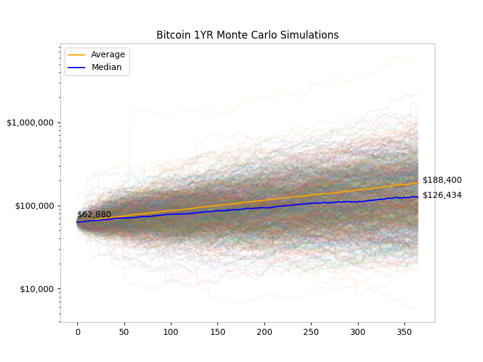

## Bitcoin Monte Carlo Simulations
Install [uv](https://docs.astral.sh/uv/) on MacOS or Linux.
```
curl -LsSf https://astral.sh/uv/install.sh | sh
```

Initialize venv and activate: 
```
uv venv
```

```
source .venv/bin/activate
```

Install packages:
```
uv pip sync requirements.lock
```

Run `main.py` to generate simulations graph. Run `update_data.py` to update bitcoin price data. For running in the terminal you can use a http server `python3 -m http.server` to view the chart at `all_simulations_chart.png`, example below. 


