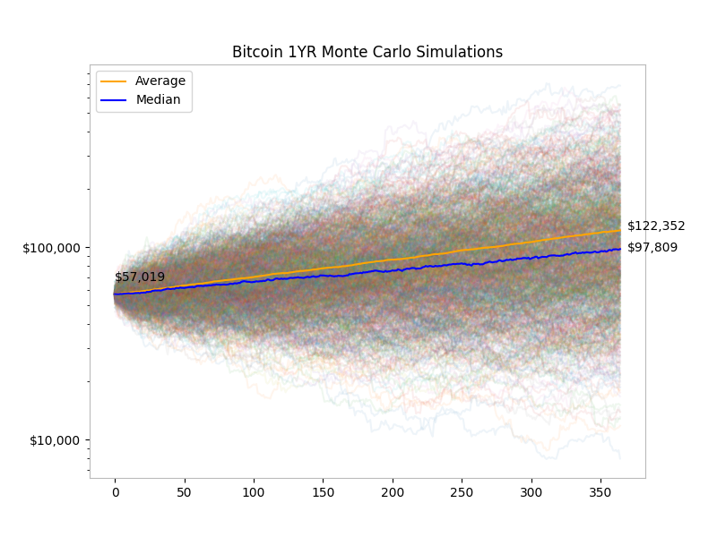

## Bitcoin Monte Carlo Simulations
Install [uv](https://github.com/astral-sh/uv) on MacOS or Linux.
```
curl -LsSf https://astral.sh/uv/install.sh | sh
```

Get the latest price data:
```
uv run update_data.py
```
Generate the graph: 
```
uv run main.py
```



